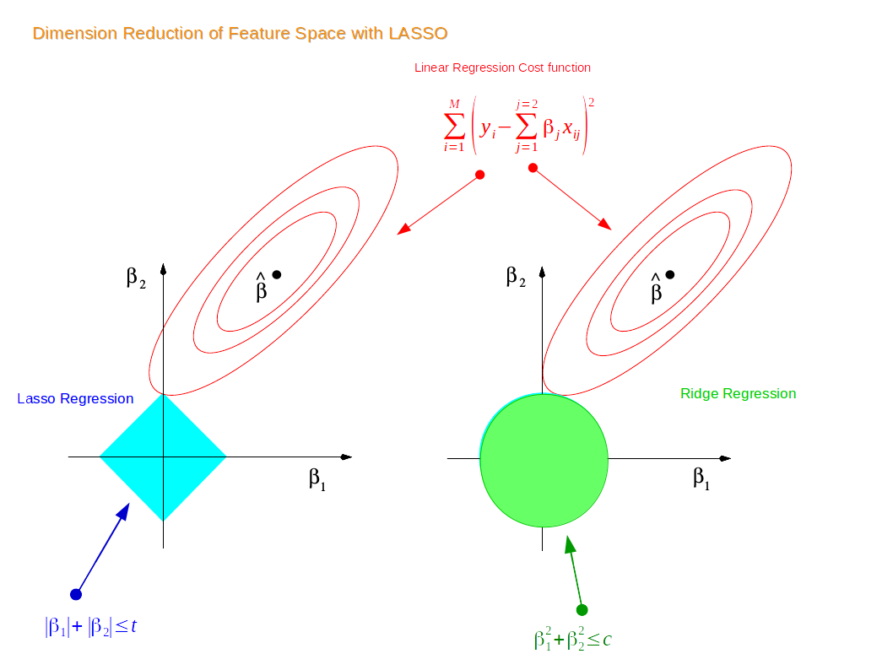

# How Lasso performs variable selection
Again, just as we discussed how shrinkage worked, we'll use the univariate model to illustrate.

### univariate example
Again we have a simple model: $y = \beta x + \epsilon$, with an L1 penalty(Lasso regression) on $\hat\beta$ and a least squares loss function on $\hat\epsilon$. We can then expand the expression for sum of squared residuals to be minimized as:
$$
\hat\beta = arg\min_\beta\{\sum_{i = 1}^{N}(y_i - x_i\beta)^2 + \lambda\sum_{j = 1}^{p}\rvert\beta_j\rvert\}
$$
For convenience, we will now substitute $2\lambda^* = \lambda$, since $2\lambda^* = \lambda$ has a one-to-one relationship, this change does not affect the result. We can then rewrite $\hat\epsilon$ in the matrix form:
$$
\hat{\beta} = arg\min_\beta\{(\vec{y} - \vec{x}\hat\beta)^{T}(\vec{y} - \vec{x}\hat\beta) + 2\lambda^*\rvert\hat{\beta}\rvert\}
$$
Which we can further expand into:
$$
\hat\beta = arg\min_\beta\{\vec{y}^{T}\vec{y} - 2\vec{y}^T\vec{x}\hat{\beta} + \hat{\beta}\vec{x}^T\vec{x}\hat{\beta} + 2\lambda^*\rvert\hat{\beta}\rvert\}
$$
Unlike the ridge regression case where we can take a derivative directly and set it equal to zero so that we can minimize the residual, here we have a $\rvert\hat{\beta}\rvert$ term which makes such procedure painful. Thus, we will instead compare different cases w.r.t. $\hat\beta$.
  Case1: $\hat\beta \geq 0$, $\rvert\hat{\beta}\rvert = \hat{\beta}$
    Since we are assuming that $\hat\beta \geq 0$, it is the same as assuming $\vec{y}^T\vec{x} \geq 0$(x's and y's have a positive relationship).
    In this case, we can rewrite the above expression as:
$$
\hat\epsilon = arg\min_\beta\{\vec{y}^{T}\vec{y} - 2\vec{y}^T\vec{x}\hat{\beta} + \hat{\beta}\vec{x}^T\vec{x}\hat{\beta} + 2\lambda^*\hat{\beta}\}
$$
    Then we can take the derivative w.r.t. $\hat\beta$ and set it equal to zero:
$$
-2\vec{y}^T\vec{x} + 2\vec{x}^T\vec{x}\hat{\beta} + 2\lambda^* =_{set} 0
$$
    Where we can obtain a solution for $\hat\beta$:
$$
\hat\beta = (\vec{y}^T\vec{x} - \lambda^*)(\vec{x}^T\vec{x})^{-1}
$$
    Obviously by increasing $\lambda^*$, we can eventually achieve $\hat\beta = 0$ at $\lambda^* = \vec{y}^T\vec{x}$. However, it is tricky to think about what happens when we increase $\lambda^*$ once $\vec{y}^T\vec{x} = 0$. The thing is that increasing $\lambda^*$ at this point will not drive $\hat{\beta}$ negative, because once the estimator $\hat\beta$ becomes negative, the derivative of the penalty term estimator becomes:
$$
-2\vec{y}^T\vec{x} + 2\vec{x}^T\vec{x}\hat{\beta} - 2\lambda^* =_{set} 0
$$
    where the flip in the sign of $\lambda^*$ is due to the absolute value function before taking the derivative. Thus, we have a new solution for $\hat\beta$:
$$
\hat\beta = (\vec{y}^T\vec{x} + \lambda^*)(\vec{x}^T\vec{x})^{-1}
$$
    This solution, however, is inconsistent with our premises $\hat\beta < 0$, since we have assumed that the least squares solution is greater than or equal to zero($\vec{y}^T\vec{x} \geq 0$), and $\lambda^* \geq 0$. For this solution, the sum of squared residual does not have an minimum anymore. Thus, we will just stick at $\hat\beta = 0$, even if $\lambda^* > \vec{y}^T\vec{x}$.
  Intuitively, when we assume that the least squares solution is negative with $\hat\beta < 0$, the logic is the same that we stick with $\hat\beta = 0$ once it reaches zero.
Note that so far we've only talked about a univariate Lasso example. When having a dataset that has multiple dimensions, as we keep increasing the value of $\lambda$(or $\lambda^*$), some of the features or variables will be zeroed out just as $\hat\beta$ shown above while some other features are shrinked toward zero but not yet reduced to zero. Therefore, the Lasso does variable selection in this manner, by shrinking some of the coefficients to zero while some non-zero.

### Shrinkage explanation from geometric perspective
Now suppose that we have a dataset with 2 features. We first train a liner model for the data, and suppose $\beta_1$ and $\beta_2$ are the coefficients for the two features. Thus by the definition of the ridge regression constraint, we have:
$$
\beta_1^2 + \beta_2^2 \leq t
$$
Similarly, for the Lasso regression contraint, we have:
$$
\rvert\beta_1\rvert + \rvert\beta_2\rvert \leq t
$$
Thus, if we plot the two constraints in a 2-dimensional coordinate system, we have:

\

Note that the red contours are the vector space for the coefficient estimator $\hat\beta$. Originally, the constraint and the vector space are separate; as we increase the constraint limit $t$, eventually the two constraints will hit the vector space, and thus achieving optimization for both the ridge regression model and the Lasso regression model. Since the 2-dimensional Lasso constraint has corners(diamond shape), if the constraint hit the vector space on one such corner, one of the two features gets dropped and shrinked to zero. In higher dimensional spaces, the diamond shape becomes rhomboid where there are more corners and more possibility for dropping one or more variables. In contrast, the constraint for ridge regression is a circle, where all points on or within the circle resemble a linear combination of the two features. Thus, technically speaking, when the ridge regression constraint hit the vector space and achieve optimization, one variable could be shrunk very close to zero while the other remain slightly shrunk, it is impossible for ridge regression to achieve variable selection in reality. Similarly, in higher dimensional space, the constraint for ridge regression becomes a sphere and the situation is very similar to what we have in the two dimensional space.