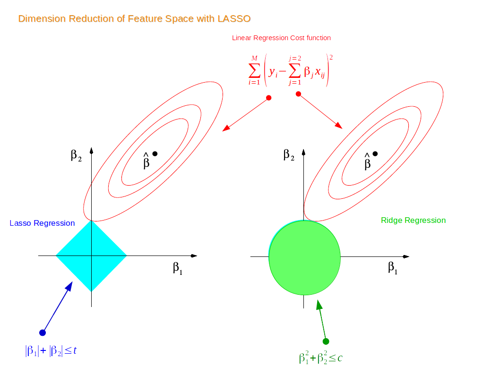

# Motivation:

```{r, echo=FALSE,warning=FALSE,message=FALSE,include=FALSE}
library(ggplot2)
library(tidyverse)
library(dplyr)
library(rsample) #for splitting data
library(caret)
library(ISLR)
library(glmnet)
library(coefplot)
```

# Introduction:
The ordinary least squared model 
$$Y = \beta_0+\beta_1X_1+\beta_2X_2+...+\beta_pX_p+\epsilon$$
is the mostly commonly used method to describe the relationship between the response variable Y and a set of variables X. However, the OLS model is not perfect and it faces two major criticism. First, the OLS model usually has low prediction accuracy because it often has large variance and low bias. The second weakness is efficient interpretation. If we have a dataset with large number of predictors, we would usually choose a small subset of predictors which are strongly associated with the response variable; thus, it seems to be a loss that we still include the weak predictors in our model. However, the linear regression model is easy to regress and interpret; therefore, we would still use linear regression method but we want to modify it in a way such that we could have higher prediction accuracy and stronger interpretation. Another important motivation to modify OLS is that OLS does not work (it doesn't have a unique solution) when there are more predictors than observations (p > n).

There are several solutions proposed by the statisticians. The first method is subset selection which is a discrete selection process. Assuming that we have p predictors, and we would build $2^p$ models to find the most predictive models within all possible combinations. However, if we have a dataset with only 10 predictors, we would have to construct 1024 models. Therefore, the subset selection is computationally inefficient. The second method is shrinkage, including ridge and lasso regression. This approach shrinks the coefficients towards zero which is a continuous selection process. The continuous selection process is less variable than the subset selection because subset selection can yield a different model if there is a small change in the dataset. Therefore, we want to use the coefficients shrinkage method to find the best model under the concept of linear regression. (One important drawback of LASSO and ridge is that it's very hard/impossible to do proper inference such as getting confidence intervals and p-values and only get estimates.) In the following sections, we would discuss the definition, application, Bayesian interpretation, and limitations for both ridge and lasso regression. 


# Definition:
Recall that the ordinary least squares model estimates coefficients with the goal of minimizing the sum of the squared residuals:
$$RSS = \sum_{i=1}^n (y_i - \beta_0-\sum_{j=1}^p\beta_jx_{ij})^2$$
Since the shrinkage approach takes into account of variable selection, the ridge regression estimates the coefficients that minimizes the combination of RSS and sum of the squared coefficients: 

## Ridge Regression:
$$
\hat{\beta^{ridge}} = arg\min_\beta\{\sum_{i = 1}^{N}(y_i - \beta_0 - \sum_{j = 1}^{p}x_{ij}\beta_j)^2 + \lambda\sum_{j = 1}^{p}\beta_j^2\} \ \ \ (1)
$$
Which is the same as:
$$
\hat{\beta^{ridge}} = arg\min_\beta\{\sum_{i = 1}^{N}(y_i - \beta_0 - \sum_{j = 1}^{p}x_{ij}\beta_j)^2\}\\
\text{subject to} \sum_{j = 1}^{p}\beta_j^2 \leq t
$$
where there is a one-to-one corresondence between the parameters $\lambda$ and $t$. 

$\lambda$ is the tuning parameter, and $\lambda\sum_{j = 1}^{p}\beta_j^2$ is the skrinkage penalty. If $\lambda$ is zero, then the penalty term equals to zero, and we would minimize the RSS, which is equivalent as ordinary least squared model; if $\lambda$ is large, then the penalty term would be larger as well, the coefficients would be smaller; therefore, if $\lambda$ approaches infinity, then the coefficients would approach zero. The selection of the optimal tuninig parameter is based on the evidence which is the MSE, and we would discuss the choice of tuning parameter later in the application.

# How does the shrinkage work
Recall from Linear Algebra that if we want to solve for $\boldsymbol{A}x = b$, we can do:
$$
\boldsymbol{A}^T\boldsymbol{A}x = \boldsymbol{A}^Ty
$$
We then take the inverse of $\boldsymbol{A}^T\boldsymbol{A}$ from the LHS, and multiply both sides by the inverse:
$$
x = (\boldsymbol{A}^T\boldsymbol{A})^{-1}\boldsymbol{A}^Ty
$$
Then we have come up with a least squares solution for x in $Ax = b$.
We will use a very similar approach to show how the shrinkage work for ridge regression.
From here, then, we get that $\hat\beta_{OLS} = (X^T X)^{-1} X^T y$

### Univariate example
Let's consider a very simple model: $y = \beta x + \epsilon$, with an L2(ridge regression) penalty on $\hat\beta$ and a least-squares loss function on $\hat{\epsilon}$. We can then expand the expression for sum of squared residuals to be minimized as:
$$
\hat\epsilon = arg\min_\beta\{\sum_{i = 1}^{N}(y_i - x_i\beta)^2 + \lambda\sum_{j = 1}^{p}\beta_j^2\}
$$
Which if we transform into a Matrix form, gives:
$$
\hat{\epsilon} = arg\min_\beta\{(\vec{y} - \vec{x}\hat\beta)^{T}(\vec{y} - \vec{x}\hat\beta) + \lambda\hat{\beta}^2\}
$$
Which we can further expand into:
$$
\hat\epsilon = arg\min_\beta\{\vec{y}^{T}\vec{y} - 2\vec{y}^T\vec{x}\hat{\beta} + \hat{\beta}\vec{x}^T\vec{x}\hat{\beta} + \lambda\hat{\beta}^2\}
$$
Now if we take the derivative w.r.t $\hat\beta$ and set equal to 0, we can calculate the the estimator for ridge regression coefficients $\hat\beta$:
$$
-2\vec{y}^T\vec{x} + 2\vec{x}^T\vec{x}\hat{\beta} + 2\lambda\hat{\beta} =_{set} 0
$$
Where we can obtain:
$$
\hat{\beta} = \vec{y}^T\vec{x}{(\vec{x}^T\vec{x} + \lambda)}^{-1}
$$

### Higher dimension ridge regression
Note that here we are using an univariate example(1-dimensional y and 1-dimensional x), in a more complicated case, we calculate the sum of squared residual in the same manner:
$$
RSS(\lambda) = (\boldsymbol{y} - \boldsymbol{X}\beta)^T(\boldsymbol{y} - \boldsymbol{X}\beta) + \lambda\beta^T\beta
$$
Where we can get:
$$
\hat{\beta} = {(\boldsymbol{X}^T\boldsymbol{X} + \lambda\boldsymbol{I})}^{-1}\boldsymbol{X}^T\boldsymbol{y}
$$
Which is very similar to the result from the univariate example.
Now, as we have mentioned above, $\lambda$ is the tuning parameter, which shrinks the coefficients more if it gets larger, thus shrinkage. We can see from this formula that increasing lambda will decrease $\hat{beta}$.However, as $\lambda$ grows too large, 

## Lasso Regression:
Lasso regression is similar to the ridge regression but its constraint is estimated with the sum of the absolute value of the coefficient: 
$$
\hat{\beta^{Lasso}} = arg\min_\beta\{\sum_{i = 1}^{N}(y_i - \beta_0 - \sum_{j = 1}^{p}x_{ij}\beta_j)^2 + \lambda\sum_{j = 1}^{p}\rvert\beta_j\rvert\} \ \ \ (1)
$$
Which is the same as:
$$
\hat{\beta^{Lasso}} = arg\min_\beta\{\sum_{i = 1}^{N}(y_i - \beta_0 - \sum_{j = 1}^{p}x_{ij}\beta_j)^2\}\\
\text{subject to} \sum_{j = 1}^{p}\rvert\beta_j\rvert \leq t
$$

Norm definition:>>>
We notice that the lasso model uses $l_1$ norm rather than the $l_2$ norm, and this approach enables the coefficients to reach zero while the ridge regression fails. The coefficients can be zero in lasso model, thus it can help us select variables which are the non-zero predictors. We would discuss this in the next part when we compare ridge with lasso in details. 

# How does the variable selection work
Again, just as we discussed how shrinkage worked, we'll use the univariate model to illustrate.

### univariate example
Again we have a simple model: $y = \beta x + \epsilon$, with an L2 penalty(Lasso regression) on $\hat\beta$ and a least squares loss function on $\hat\epsilon$. We can then expand the expression for sum of squared residuals to be minimized as:
$$
\hat\epsilon = arg\min_\beta\{\sum_{i = 1}^{N}(y_i - x_i\beta)^2 + \lambda\sum_{j = 1}^{p}\rvert\beta_j\rvert\}
$$
For convenience, we will now substitute $2\lambda^* = \lambda$, since $2\lambda^* = \lambda$ has a one-to-one relationship, this change does not affect the result. We can then rewrite $\hat\epsilon$ in the matrix form:
$$
\hat{\epsilon} = arg\min_\beta\{(\vec{y} - \vec{x}\hat\beta)^{T}(\vec{y} - \vec{x}\hat\beta) + 2\lambda^*\rvert\hat{\beta}\rvert\}
$$
Which we can further expand into:
$$
\hat\epsilon = arg\min_\beta\{\vec{y}^{T}\vec{y} - 2\vec{y}^T\vec{x}\hat{\beta} + \hat{\beta}\vec{x}^T\vec{x}\hat{\beta} + 2\lambda^*\rvert\hat{\beta}\rvert\}
$$
Unlike the ridge regression case where we can take a derivative directly and set it equal to zero so that we can minimize the residual, here we have a $\rvert\hat{\beta}\rvert$ term which makes such procedure painful. Thus, we will instead compare different cases w.r.t. $\hat\beta$.
  + Case1: $\hat\beta \geq 0$, $\rvert\hat{\beta}\rvert = \hat{\beta}$
    - Since we are assuming that $\hat\beta \geq 0$, it is the same as assuming $\vec{y}^T\vec{x} \geq 0$(x's and y's have a positive relationship).
    - In this case, we can rewrite the above expression as:
$$
\hat\epsilon = arg\min_\beta\{\vec{y}^{T}\vec{y} - 2\vec{y}^T\vec{x}\hat{\beta} + \hat{\beta}\vec{x}^T\vec{x}\hat{\beta} + 2\lambda^*\hat{\beta}\}
$$
    - Then we can take the derivative w.r.t. $\hat\beta$ and set it equal to zero:
$$
-2\vec{y}^T\vec{x} + 2\vec{x}^T\vec{x}\hat{\beta} + 2\lambda^* =_{set} 0
$$
    - Where we can obtain a solution for $\hat\beta$:
$$
\hat\beta = (\vec{y}^T\vec{x} - \lambda^*)(\vec{x}^T\vec{x})^{-1}
$$
    - Obviously by increasing $\lambda^*$, we can eventually achieve $\hat\beta = 0$ at $\lambda^* = \vec{y}^T\vec{x}$. However, it is tricky to think about what happens when we increase $\lambda^*$ once $\vec{y}^T\vec{x} = 0$. The thing is that increasing $\lambda^*$ at this point will not drive $\hat{\beta}$ negative, because once the estimator $\hat\beta$ becomes negative, the derivative of the penalty term estimator becomes:
$$
-2\vec{y}^T\vec{x} + 2\vec{x}^T\vec{x}\hat{\beta} + 2\lambda^* =_{set} 0
$$
    - where the flip in the sign of $\lambda^*$ is due to the absolute value function before taking the derivative. Thus, we have a new solution for $\hat\beta$:
$$
\hat\beta = (\vec{y}^T\vec{x} + \lambda^*)(\vec{x}^T\vec{x})^{-1}
$$
    - This solution, however, is inconsistent with our premises $\hat\beta < 0$, since we have assumed that the least squares solution is greater than or equal to zero($\vec{y}^T\vec{x} \geq 0$), and $\lambda^* \geq 0$. For this solution, the sum of squared residual does not have an minimum anymore. Thus, we will just stick at $\hat\beta = 0$, even if $\lambda^* > \vec{y}^T\vec{x}$.
  + Intuitively, when we assume that the least squares solution is negative with $\hat\beta < 0$, the logic is the same that we stick with $\hat\beta = 0$ once it reaches zero.
Note that so far we've only talked about a univariate Lasso example. When having a dataset that has multiple dimensions, as we keep increasing the value of $\lambda$(or $\lambda^*$), some of the features or variables will be zeroed out just as $\hat\beta$ shown above while some other features are shrinked toward zero but not yet reduced to zero. Therefore, the Lasso does variable selection in this manner, by shrinking some of the coefficients to zero while some non-zero.  


## Comparison between Ridge and Lasso Model
### Shrinkage explaination from geometric perspective
Now suppose that we have a dataset with 2 features. We first train a liner model for the data, and suppose $\beta_1$ and $\beta_2$ are the coefficients for the two features. Thus by the definition of the ridge regression constraint, we have:
$$
\beta_1^2 + \beta_2^2 \leq t
$$
Similarly, for the Lasso regression contraint, we have:
$$
\rvert\beta_1\rvert + \rvert\beta_2\rvert \leq t
$$
Thus, if we plot the two constraints in a 2-dimensional coordinate system, we have:


Note that the red contours are the vector space for the coefficient estimator $\hat\beta$. Originally, the constraint and the vector space are separate; as we increase the constraint limit $t$, eventually the two constraints will hit the vector space, and thus achieving optimization for both the ridge regression model and the Lasso regression model. Since the 2-dimensional Lasso constraint has corners(diamond shape), if the constraint hit the vector space on one such corner, one of the two features gets dropped and shrinked to zero. In higher dimensional spaces, the diamond shape becomes rhomboid where there are more corners and more possibility for dropping one or more variables. In contrast, the constraint for ridge regression is a circle, where all points on or within the circle resemble a linear combination of the two features. Thus, technically speaking, when the ridge regression constraint hit the vector space and achieve optimization, one variable could be shrunk very close to zero while the other remain slightly shrunk, it is impossible for ridge regression to achieve variable selection in reality. Similarly, in higher dimensional space, the constraint for ridge regression becomes a shpere and the situation is very similar to what we have in the two dimensional space.


# Applications of Ridge and Lasso
## Choice between Ridge and Lasso
## Choice of optimal tuning parameter

# Cross validation
> Cross validation randomly divides the data set into ten folds and in each fold the data is divided into ten groups, nine training groups to which models will be fitted and one testing group to test the model.

```{r}
# Load the data
# Highly correlated
# Numerical
bf<-read.csv("bodyfat.csv")

set.seed(455)
bf_split <- initial_split(bf%>%select(-Density), prop = .7)
bf_train <- training(bf_split)
bf_test <- testing(bf_split)
```

## WITHOUT CV

# OLS

```{r}
set.seed(455)
bf_ols <- train(
  bodyfat ~ .,
  data = bf_train, 
  method = "lm",
  na.action = na.omit
)

coefficients(bf_ols$finalModel)

bf_ols$results$RMSE
```

# RIDGE

```{r}
set.seed(455)
bf_ridge <- train(
  bodyfat ~ .,
  data = bf_train, 
  method = "glmnet",
  tuneGrid = data.frame(alpha = 0, 
                        lambda = 10^seq(-3,0, length = 100)),
  na.action = na.omit
)

bf_ridge%>%
  ggplot(aes(x=lambda,y=RMSE))+
  geom_point(size = .5, alpha = .5)

bf_ridge$bestTune$lambda

plot(bf_ridge$finalModel,xvar="lambda",label=TRUE)
```

```{r}
set.seed(455)
bf_ridge_best <- train(
  bodyfat ~ .,
  data = bf_train, 
  method = "glmnet",
  tuneGrid = data.frame(alpha = 0, 
                        lambda = 0.6135907),
  na.action = na.omit
)

bf_ridge_best$results$RMSE
```

# LASSO

```{r}
set.seed(455)
bf_lasso <- train(
  bodyfat ~ .,
  data = bf_train, 
  method = "glmnet",
  tuneGrid = data.frame(alpha = 1, 
                        lambda = 10^seq(-3, -1, length = 100)),
  na.action = na.omit
)

bf_lasso%>%
  ggplot(aes(x=lambda,y=RMSE))+
  geom_point(size = .5, alpha = .5)

bf_lasso$bestTune$lambda

plot(bf_lasso$finalModel,xvar='lambda',label=TRUE)
```

```{r}
set.seed(455)
bf_lasso_best <- train(
  bodyfat ~ .,
  data = bf_train, 
  method = "glmnet",
  tuneGrid = data.frame(alpha = 1, 
                        lambda = 0.05214008),
  na.action = na.omit
)

bf_lasso_best$results$RMSE
```

```{r}
bf_test%>%
  mutate(pred_bf = predict(bf_ols, newdata = bf_test)) %>% 
  summarize(RMSE = sqrt(mean((bodyfat - pred_bf)^2)))

bf_test%>%
  mutate(pred_bf = predict(bf_ridge_best, newdata = bf_test)) %>% 
  summarize(RMSE = sqrt(mean((bodyfat - pred_bf)^2)))

bf_test%>%
  mutate(pred_bf = predict(bf_lasso_best, newdata = bf_test)) %>% 
  summarize(RMSE = sqrt(mean((bodyfat - pred_bf)^2)))
```

## WITH CV

# OLS

```{r}
set.seed(455)
bf_ols <- train(
  bodyfat ~ .,
  data = bf_train, 
  method = "lm",
  trControl = trainControl(method = "cv", 
                           number = 10), 
  na.action = na.omit
)

coefficients(bf_ols$finalModel)

bf_ols$results$RMSE
```

# RIDGE

```{r}
set.seed(455)
bf_ridge <- train(
  bodyfat ~ .,
  data = bf_train, 
  method = "glmnet",
  trControl = trainControl(method = "cv", 
                           number = 10),
  tuneGrid = data.frame(alpha = 0, 
                        lambda = 10^seq(-3,0, length = 100)),
  na.action = na.omit
)

bf_ridge%>%
  ggplot(aes(x=lambda,y=RMSE))+
  geom_point(size = .5, alpha = .5)

bf_ridge$bestTune$lambda

plot(bf_ridge$finalModel,xvar="lambda",label=TRUE)
```

```{r}
set.seed(455)
bf_ridge_best <- train(
  bodyfat ~ .,
  data = bf_train, 
  method = "glmnet",
  trControl = trainControl(method = "cv", 
                           number = 10),
  tuneGrid = data.frame(alpha = 0, 
                        lambda = 0.6135907),
  na.action = na.omit
)

bf_ridge_best$results$RMSE
```

# LASSO

```{r}
set.seed(455)
bf_lasso <- train(
  bodyfat ~ .,
  data = bf_train, 
  method = "glmnet",
  trControl = trainControl(method = "cv", 
                           number = 10),
  tuneGrid = data.frame(alpha = 1, 
                        lambda = 10^seq(-3, -1, length = 100)),
  na.action = na.omit
)

bf_lasso%>%
  ggplot(aes(x=lambda,y=RMSE))+
  geom_point(size = .5, alpha = .5)

bf_lasso$bestTune$lambda

plot(bf_lasso$finalModel,xvar='lambda',label=TRUE)
```

```{r}
set.seed(455)
bf_lasso_best <- train(
  bodyfat ~ .,
  data = bf_train, 
  method = "glmnet",
  trControl = trainControl(method = "cv", 
                           number = 10),
  tuneGrid = data.frame(alpha = 1, 
                        lambda = 0.05214008),
  na.action = na.omit
)

bf_lasso_best$results$RMSE
```

```{r}
bf_test%>%
  mutate(pred_bf = predict(bf_ols, newdata = bf_test)) %>% 
  summarize(RMSE = sqrt(mean((bodyfat - pred_bf)^2)))

bf_test%>%
  mutate(pred_bf = predict(bf_ridge_best, newdata = bf_test)) %>% 
  summarize(RMSE = sqrt(mean((bodyfat - pred_bf)^2)))

bf_test%>%
  mutate(pred_bf = predict(bf_lasso_best, newdata = bf_test)) %>% 
  summarize(RMSE = sqrt(mean((bodyfat - pred_bf)^2)))
```

```{r,echo=FALSE,warning=FALSE,message=FALSE,include=FALSE}
# Load the data
# Not highly correlated
# Numerical+categorial
cars<- read_csv("https://raw.githubusercontent.com/juliasilge/supervised-ML-case-studies-course/master/data/cars2018.csv")

set.seed(455)
cars_split <- initial_split(cars%>%select(-`Model Index`, -Model), prop = .7)
cars_train <- training(cars_split)
cars_test <- testing(cars_split)
```

# OLS

```{r}
set.seed(455)
cars_ols <- train(
  MPG ~ .,
  data = cars_train, 
  method = "lm",
  trControl = trainControl(method = "cv", 
                           number = 10), 
  na.action = na.omit
)

coefficients(cars_ols$finalModel)

cars_ols$results$RMSE
```

# RIDGE

```{r}
set.seed(455)
cars_ridge <- train(
  MPG ~ .,
  data = cars_train, 
  method = "glmnet",
  trControl = trainControl(method = "cv", 
                           number = 10),
  tuneGrid = data.frame(alpha = 0, 
                        lambda = 10^seq(-3,0, length = 100)),
  na.action = na.omit
)

cars_ridge%>%
  ggplot(aes(x=lambda,y=RMSE))+
  geom_point(size = .5, alpha = .5)

cars_ridge$bestTune$lambda

plot(cars_ridge$finalModel,xvar="lambda",label=TRUE)
```

```{r}
set.seed(455)
cars_ridge_best <- train(
  MPG ~ .,
  data = cars_train, 
  method = "glmnet",
  trControl = trainControl(method = "cv", 
                           number = 10),
  tuneGrid = data.frame(alpha = 0, 
                        lambda = 0.3764936),
  na.action = na.omit
)

cars_ridge_best$results$RMSE
```

# LASSO

```{r}
set.seed(455)
cars_lasso <- train(
  MPG ~ .,
  data = cars_train, 
  method = "glmnet",
  trControl = trainControl(method = "cv", 
                           number = 10),
  tuneGrid = data.frame(alpha = 1, 
                        lambda = 10^seq(-3, -2, length = 100)),
  na.action = na.omit
)

cars_lasso%>%
  ggplot(aes(x=lambda,y=RMSE))+
  geom_point(size = .5, alpha = .5)

cars_lasso$bestTune$lambda

plot(cars_lasso$finalModel,xvar='lambda',label=TRUE)
```

```{r}
set.seed(455)
cars_lasso_best <- train(
  MPG ~ .,
  data = cars_train, 
  method = "glmnet",
  trControl = trainControl(method = "cv", 
                           number = 10),
  tuneGrid = data.frame(alpha = 1, 
                        lambda = 0.009545485),
  na.action = na.omit
)

cars_lasso_best$results$RMSE
```

```{r}
cars_test%>%
  mutate(pred_mpg = predict(cars_ols, newdata = cars_test)) %>% 
  summarize(RMSE = sqrt(mean((MPG - pred_mpg)^2)))

cars_test%>%
  mutate(pred_mpg = predict(cars_ridge_best, newdata = cars_test)) %>% 
  summarize(RMSE = sqrt(mean((MPG - pred_mpg)^2)))

cars_test%>%
  mutate(pred_mpg = predict(cars_lasso_best, newdata = cars_test)) %>% 
  summarize(RMSE = sqrt(mean((MPG - pred_mpg)^2)))
```

# Data Summary


> From the summary table above, we can see that for the highly corrlated numerical dataset bodyfat, lasso gives the smallest training RMSE while ridge gives the smallest testing RMSE. For the less correlated dataset cars with categorical variables included, lasso always gives the smallest RMSE.

# Generalization of shrinkage methods from Bayes perspective
Bayesian estimation assumes the coefficients have prior distribution, $p(\beta)$, where $\beta =(\beta_0,\beta_1...\beta_p)^T$. The likelihood of data is $f(Y\rvert X,\beta)$, where $X = (X_1...X_p)$. Therefore, we can derive the formula for posterior distribution of $\beta$:
$$p(\beta\rvert Y,X ) \propto f(Y\rvert X,\beta)p(\beta\rvert X) = f(Y\rvert X,\beta)p(\beta)$$

# Bayesian Interpretation

We can show that $\hat{\boldsymbol\beta}_{LASSO}$ has a Bayesian interpretation. In particular, we can show that is a Bayes estimator for $\boldsymbol\beta$ assuming a multivariate Normal likelihood for $\mathbf{y}$:
$$f(y\mid \boldsymbol\beta, \sigma^2)\sim N(\mathbf{X}\boldsymbol\beta, \sigma^2\mathbf{I}),$$
and an independent double exponential (aka Laplace) prior for $\boldsymbol\beta$: 
$$f(\beta_j) = \left(\frac{\lambda}{2} \right)\exp(-\lambda |\beta_j|)$$

## Posterior

The posterior distribution for $\boldsymbol\beta$ (assuming $\sigma^2 = 1$ for simplicity): 

$$\begin{aligned}
g(\boldsymbol\beta \mid y)&\propto f(y \mid \boldsymbol\beta, \sigma^2) f(\boldsymbol\beta)\\
&= f(y \mid \boldsymbol\beta) \prod_{i=1}^p f(\beta_j)\text{, by independence assumption}\\
&=(2\pi)^{-n/2}\exp\left(-\frac{1}{2}(\mathbf{y} - \mathbf{X}\boldsymbol\beta)^\top (\mathbf{y} - \mathbf{X}\boldsymbol\beta) \right) \left(\frac{\lambda}{2}\right)^p \exp\left(-\lambda\sum_{j=1}^p |\beta_j|)\right)\\
&\propto\exp\left(-\frac{1}{2}(\mathbf{y} - \mathbf{X}\boldsymbol\beta)^\top (\mathbf{y} - \mathbf{X}\boldsymbol\beta) \right) \exp\left(-\lambda\sum_{j=1}^p |\beta_j|)\right)\\
&=\exp\left(-\frac{1}{2}(\mathbf{y} - \mathbf{X}\boldsymbol\beta)^\top (\mathbf{y} - \mathbf{X}\boldsymbol\beta)-\lambda\sum_{j=1}^p |\beta_j|)\right)
\end{aligned}$$

## Posterior Mode

Maximize the posterior distribution, or minimize the -log posterior

# Maximize the posterior distribution

$$\frac{d}{d\boldsymbol\beta}=$$
# Minimize the -log posterior

$$\text{-log posterior: }\frac{1}{2}(\mathbf{y} - \mathbf{X}\boldsymbol\beta)^\top (\mathbf{y} - \mathbf{X}\boldsymbol\beta)-\lambda\sum_{j=1}^p |\beta_j|\\
\frac{d}{d\boldsymbol\beta}=$$