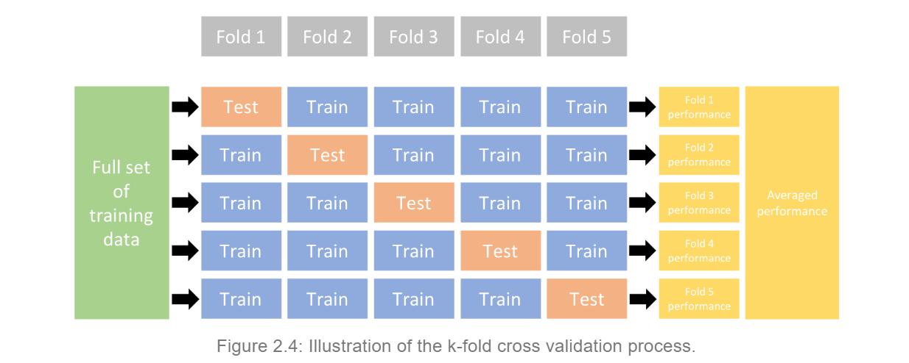

```{r, echo=FALSE,warning=FALSE,message=FALSE,include=FALSE}
library(readr)
library(rsample)
library(caret)
library(glmnet)
library(dplyr)
```

# Bayesian Lasso

## Bayesian Interpretation

We can show that $\hat{\boldsymbol\beta}_{LASSO}$ has a Bayesian interpretation. In particular, we can show that is a Bayes estimator for $\boldsymbol\beta$ assuming a multivariate Normal likelihood for $\mathbf{y}$:
$$f(y\mid \boldsymbol\beta, \sigma^2)\sim N(\mathbf{X}\boldsymbol\beta, \sigma^2\mathbf{I}),$$
and an independent double exponential (aka Laplace) prior for $\boldsymbol\beta$: 
$$f(\beta_j) = \left(\frac{\lambda}{2} \right)\exp(-\lambda |\beta_j|)$$

## Posterior

The posterior distribution for $\boldsymbol\beta$ (assuming $\sigma^2 = 1$ for simplicity): 

$$\begin{aligned}
g(\boldsymbol\beta \mid y)&\propto f(y \mid \boldsymbol\beta, \sigma^2) f(\boldsymbol\beta)\\
&= f(y \mid \boldsymbol\beta) \prod_{i=1}^p f(\beta_j)\text{, by independence assumption}\\
&=(2\pi)^{-n/2}\exp\left(-\frac{1}{2}(\mathbf{y} - \mathbf{X}\boldsymbol\beta)^\top (\mathbf{y} - \mathbf{X}\boldsymbol\beta) \right) \left(\frac{\lambda}{2}\right)^p \exp\left(-\lambda\sum_{j=1}^p |\beta_j|)\right)\\
&\propto\exp\left(-\frac{1}{2}(\mathbf{y} - \mathbf{X}\boldsymbol\beta)^\top (\mathbf{y} - \mathbf{X}\boldsymbol\beta) \right) \exp\left(-\lambda\sum_{j=1}^p |\beta_j|)\right)\\
&=\exp\left(-\frac{1}{2}(\mathbf{y} - \mathbf{X}\boldsymbol\beta)^\top (\mathbf{y} - \mathbf{X}\boldsymbol\beta)-\lambda\sum_{j=1}^p |\beta_j|)\right)
\end{aligned}$$

## Posterior Mode

Maximizing the posterior distribution, or minimizing the $-\log$ posterior, leads to $\beta_{LASSO}$.

$$\begin{aligned}\\
&\arg\max\text{ }\exp\left(-\frac{1}{2}(\mathbf{y} - \mathbf{X}\boldsymbol\beta)^\top (\mathbf{y} - \mathbf{X}\boldsymbol\beta)-\lambda\sum_{j=1}^p |\beta_j|)\right)\\
=\text{ }&\arg\max\text{ }-\frac{1}{2}(\mathbf{y} - \mathbf{X}\boldsymbol\beta)^\top (\mathbf{y} - \mathbf{X}\boldsymbol\beta)-\lambda\sum_{j=1}^p |\beta_j|\\
=\text{ }&\arg\min\text{ }\frac{1}{2}(\mathbf{y} - \mathbf{X}\boldsymbol\beta)^\top (\mathbf{y} - \mathbf{X}\boldsymbol\beta)+\lambda\sum_{j=1}^p |\beta_j|\\
=\text{ }&\arg\min\text{ -log posterior}\\
\end{aligned}$$

$$\begin{aligned}
\arg\min\text{ -log posterior}
&=\arg\min-\log(\exp\left(-\frac{1}{2}(\mathbf{y} - \mathbf{X}\boldsymbol\beta)^\top (\mathbf{y} - \mathbf{X}\boldsymbol\beta)-\lambda\sum_{j=1}^p |\beta_j|)\right))\\
&=\arg\min-\left(-\frac{1}{2}(\mathbf{y} - \mathbf{X}\boldsymbol\beta)^\top (\mathbf{y} - \mathbf{X}\boldsymbol\beta)-\lambda\sum_{j=1}^p |\beta_j|)\right)\\
&=\arg\min\frac{1}{2}(\mathbf{y} - \mathbf{X}\boldsymbol\beta)^\top (\mathbf{y} - \mathbf{X}\boldsymbol\beta)+\lambda\sum_{j=1}^p |\beta_j|\\
&=\beta_{LASSO}\text{, by definition}
\end{aligned}$$

# Applications of Ridge and Lasso

## Cross Validation


(from Hands-On Machine Learning with R 2.4 by Bradley Boehmke & Brandon Greenwell)

Cross validation randomly divides the data set into k folds, k-1 training groups to which models will be fitted and 1 testing group to test the model. For example, in the image above, the dataset is divided into 5 groups, the blue ones as the training groups and the pink one as the test group. The process is repeated 5 times and averaging the RMSE for each time gives the cross-validation RMSE of the model. In our simulation, k=10 will be used to minimize the variability and imporve the accuracy of the models.

## Dataset

```{r,echo=FALSE,warning=FALSE,message=FALSE,include=FALSE}
cars2018 <- read_csv("cars2018.csv", col_types = cols(Model = col_skip(), 
    `Model Index` = col_skip()))
```

```{r,echo=FALSE,warning=FALSE,message=FALSE,include=FALSE}
set.seed(455)
cars_split <- initial_split(cars2018, prop = .7)
cars_train <- training(cars_split)
cars_test <- testing(cars_split)
```

This dataset is obtained from https://raw.githubusercontent.com/juliasilge/supervised-ML-case-studies-course/master/data/cars2018.csv. The goal is the find how different features of a car affect its MPG. The outcome variable is numerical while the predictor variables are a mix of numerical and categorical variables. The dataset is splitted into training data with 70% of the data and test data with 30%.

## OLS

We first fit an OLS model to the training data. The result shows that the coefficient for Gears is 0.1338 and the coefficient for Cylinders is 0.5918. The RMSE for this model is 3.0272.

```{r,echo=FALSE,warning=FALSE,message=FALSE,include=FALSE}
set.seed(455)
cars_ols <- train(
  MPG ~ .,
  data = cars_train, 
  method = "lm",
  trControl = trainControl(method = "cv", 
                           number = 10), 
  na.action = na.omit
)

coefficients(cars_ols$finalModel)

cars_ols$results$RMSE
```

## RIDGE

Secondly, we fit a ridge model to the training data. We try with a range of lambda values and use the bestTune$lambda function to find the lambda value that minimizes the RMSE. Then we plug in this lambda value and make a new ridge model. We get a RMSE of 3.0743, which is slightly higher than the OLS RMSE. The coefficient for Cylinders is shrunk to -0.4284 and the one for Gear is shrunk to -0.0064, but none of the coefficients is set to 0 though some of them are close to 0. The graph below shows the shrinkage of coefficients. We can see the as lambda increases, all of them get close to 0 but not equal to 0.

```{r,echo=TRUE,warning=FALSE,message=FALSE,results='hide'}
set.seed(455)
cars_ridge <- train(
  MPG ~ .,
  data = cars_train, 
  method = "glmnet",
  trControl = trainControl(method = "cv", 
                           number = 10),
  tuneGrid = data.frame(alpha = 0, 
                        lambda = 10^seq(-3,0, length = 100)),
  na.action = na.omit
)

cars_ridge$bestTune$lambda
```

```{r,echo=FALSE,warning=FALSE,message=FALSE,results='hold'}
plot(cars_ridge$finalModel,xvar="lambda",label=TRUE)
```

```{r,echo=FALSE,warning=FALSE,message=FALSE,results='hide'}
set.seed(455)
cars_ridge_best <- train(
  MPG ~ .,
  data = cars_train, 
  method = "glmnet",
  trControl = trainControl(method = "cv", 
                           number = 10),
  tuneGrid = data.frame(alpha = 0, 
                        lambda = 0.3764936),
  na.action = na.omit
)

cars_ridge_best$results$RMSE

coefficients(cars_ridge_best$finalModel,0.3764936)
```

## LASSO

We repeat the same process to fit the LASSO model. In terms of coding, the only difference is to change the alpha value in the tuneGrid from 0 to 1. We get a RMSE of 3.0255, which is the smallest. Some coefficients such as Cylinders and Gears are set to 0. It is interesting that the coefficient TransmissionManual is set to 0 while TransmissionCVT, the other term of the same categorical variable, is not. This leads to one of the limitation of LASSO models when analyzing categorical variables. From the graph showing the shrinkage of coefficients, we can see the as lambda increases, all of them get to exactly 0.

```{r,echo=TRUE,warning=FALSE,message=FALSE,results='hide'}
set.seed(455)
cars_lasso <- train(
  MPG ~ .,
  data = cars_train, 
  method = "glmnet",
  trControl = trainControl(method = "cv", 
                           number = 10),
  tuneGrid = data.frame(alpha = 1, 
                        lambda = 10^seq(-3, -2, length = 100)),
  na.action = na.omit
)

cars_lasso$bestTune$lambda
```

```{r,echo=FALSE,warning=FALSE,message=FALSE,results='hold'}
plot(cars_lasso$finalModel,xvar='lambda',label=TRUE)
```

```{r,echo=FALSE,warning=FALSE,message=FALSE,results='hide'}
set.seed(455)
cars_lasso_best <- train(
  MPG ~ .,
  data = cars_train, 
  method = "glmnet",
  trControl = trainControl(method = "cv", 
                           number = 10),
  tuneGrid = data.frame(alpha = 1, 
                        lambda = 0.009545485),
  na.action = na.omit
)

cars_lasso_best$results$RMSE

coefficients(cars_lasso_best$finalModel,0.009545485)
```

```{r,echo=FALSE,warning=FALSE,message=FALSE,results='hold'}
coefficients(cars_lasso_best$finalModel,0.1)
```

## Test data

We also apply the models to the test data to obtain the test RMSEs.

```{r,echo=FALSE,warning=FALSE,message=FALSE,results='hide'}
cars_test%>%
  mutate(pred_mpg = predict(cars_ols, newdata = cars_test)) %>% 
  summarize(RMSE = sqrt(mean((MPG - pred_mpg)^2)))

cars_test%>%
  mutate(pred_mpg = predict(cars_ridge_best, newdata = cars_test)) %>% 
  summarize(RMSE = sqrt(mean((MPG - pred_mpg)^2)))

cars_test%>%
  mutate(pred_mpg = predict(cars_lasso_best, newdata = cars_test)) %>% 
  summarize(RMSE = sqrt(mean((MPG - pred_mpg)^2)))
```

## Summary


From the summary table above, we can see that for this dataset, lasso always gives the smallest RMSE no matter for the training group or the testing group.